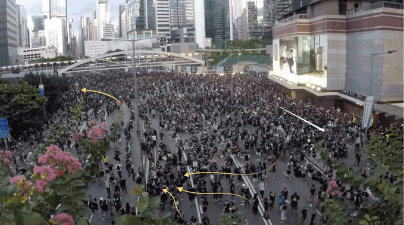

## Be like water protest tactics.
### SUPPLY CHAIN:
- A human chain delivers a steady flow of helmets, umbrellas, masks, and goggles to the front line. This is faster and creates less extra foot traffic, and it allows moving protesters to skirt the area where the chain is operating.

Video: https://vimeo.com/447199354

- This diagram shows the flow of supplies along a human chain to the front line, and indicates where crowds of protesters can march past without interfering.

### HAND SIGNALS:
- Protesters have developed simple hand signals to communicate. Soldiers have always used visual signals in battle. They carry over long distances in noisy environments.

Hand signal for "HELMET" Video: https://vimeo.com/447222320

Hand signal for "UMBRELLA" Video: https://vimeo.com/447224391

Hand signals for "HELMETS" (left) and "UMBRELLAS" (right)

__[:point_left: BACK](README.md)__
