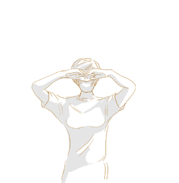
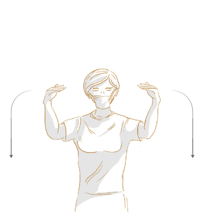
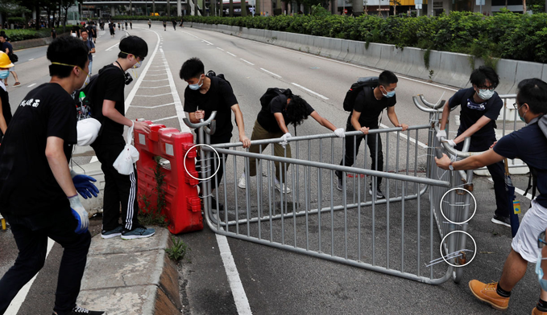
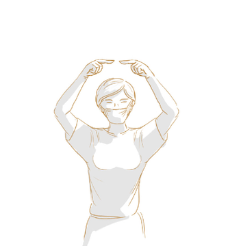
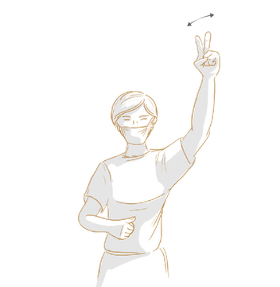
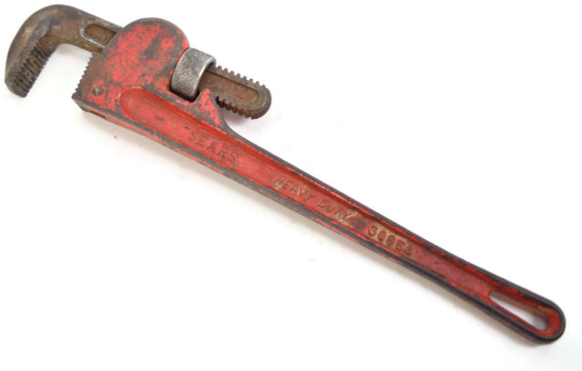
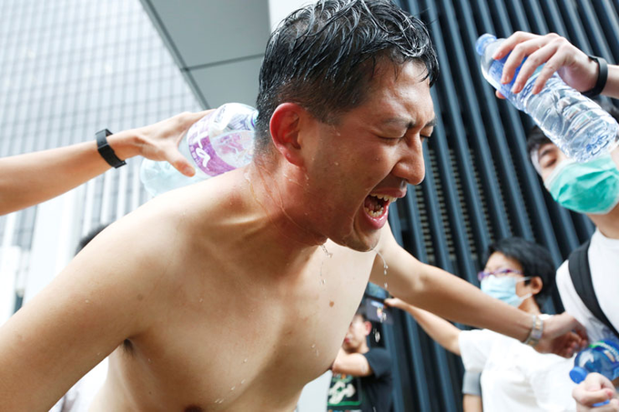

## Be like water protest tactics.

> "Water cant be destroyed. If you burn it, it turns to vapour then turns back to water. If you freeze it, it turns to ice. When the ice melts, it turns back to water. Be resilient like water. It will frustrate your enemies and restate your dominance"

### SUPPLY CHAIN:
- A human chain delivers a steady flow of helmets, umbrellas, masks, and goggles to the front line. This is faster and creates less extra foot traffic, and it allows moving protesters to skirt the area where the chain is operating.

- Video: https://vimeo.com/447199354

- This diagram shows the flow of supplies along a human chain to the front line, and indicates where crowds of protesters can march past without interfering.

### HAND SIGNALS:
- Protesters have developed simple hand signals to communicate. Soldiers have always used visual signals in battle. They carry over long distances in noisy environments.

- Hand signal for "HELMET" Video: https://vimeo.com/447222320

- Hand signal for "UMBRELLA" Video: https://vimeo.com/447224391

Hand signals for "HELMETS" (left) and "UMBRELLAS" (right)

- Protesters use plastic wrap (cling wrap) around the uncovered parts of their face, neck, and forearms to shield skin from OC spray, PAVA (pelargonic acid vanillylamide), and CS irritant

Hand signals for "MASKS" (left) and "PLASTIC WRAP" (right)

- Not all protesters will be wearing full protective gear (like full-face gas masks). It's expensive and difficult to obtain. Protesters make do with what they have, with support.

Hand signals for "EYE RINSE" (left) and "ASTHMA INHALER" (right).

- Makeshift barricades are crucial to stopping the police "Zerg rush", where they charge protesters, knock some to the ground, and arrest them.

Hand signals for "GOGGLES" (left) and "BARRICADE NEEDED" (right). The arrows indicate hand movement.

### BARRICADE CONSTRUCTION:
- Barricades are easily assembled from found items like fences, railings, and construction equipment. Note the use of zip ties. The barricade protects from the police Zerg rush, a common arrest tactic.

### BARRICADE DEPLOYMENT:
- Barricades are used to protect from police clearance operations. As we've seen in Portland, police like to launch surprise "clearing" attacks against the flanks of the crowd while protesters are distracted by the front. Video: https://vimeo.com/447239654
- Quickly deploy barricades to protect the front line's vulnerable flanks. Allow wide-open egress from front lines to "green" zone territory (owned by large crowds of friendlies). Don't create chokepoints or trample hazards. Video: https://vimeo.com/447240219
- Protesters will need cable ties and sturdy scissors (get blunt-tipped shears, so you can't be accused of carrying a pointed weapon).

Hand signals for "CABLE TIES" (left) and "SCISSORS" (right).

- Road signs are easy to dismantle to use for shields and barricades. Protesters learn to stage allen wrenches, monkey wrenches with long handles (for torque against vandal-proof nuts used on traffic signs) near protests.

### EYE FLUSH: 
- If you see someone who appears to be blinded, gently place your hand on their shoulder and ask if they'd like you to guide them to an eye wash station. CONSENT: DO NOT try to move people or treat them without ASKING and explaining!

### DRESS EN BLOC:
- The Black Bloc dress code exists for a very good reason.
- "But I don't want to look like a protester!" YES YOU DO.
- If you stand out in ANY way, you will be filmed, identified, and arrested later. Blend in.
- Go a step further.  Get a lightweight balaclava that has enough stretch to accomodate your respirator. This serves a number of functions.  Face covering, hair covering and an extra layer against OC spray. Layers will be important.
### NO FASHION AT PROTESTS
- Wear nothing distinctive. No jewelry, no tattoos, no logos. 
- Plain black hoodie, dark sneakers/boots.
- Black ski mask OVER HEADGEAR. Hide your hair.
- Harder to prosecute if everyone looks identical.
- A woman faces 10 years in prison after police tracked her down using the shirt she was wearing in a journalist's photo (A Philadelphia protester who allegedly torched 2 cop cars was caught b/c of a pic showing a forearm tattoo + her T-shirt. FBI found the shirt on Etsy. That led to a Poshmark account + username, then a LinkedIn, revealing a massage therapist).
- Reporters and live-streamers are NOT there to protect you. Protect yourself.
- Be mindful if all the things that can ID you.  
- Get some black boots or black chuck taylor allstars. Please stop wearing those beautiful shoes that cost you a paycheck. They are gonna get wrecked and they are an ID fingerprint.
### OBTAINING WATER:
- Most urban protest areas have plenty of bottled water available else look around for public water places.
### SHIELDS:
- Journalists and protesters need shields to protect themselves from impact munitions. Durable, cheap, and splinter-free. Don't overthink it. It's better to have 100 "ok" shields than 5 amazing ones.

Thanks to  https://twitter.com/chadloder/status/1287120932008427520

__[:point_left: BACK](README.md)__
